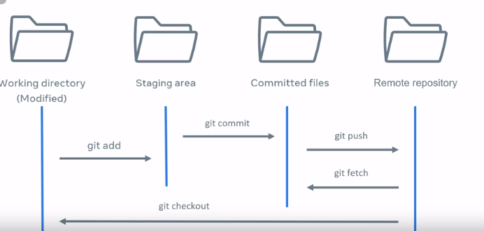
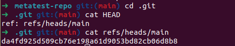
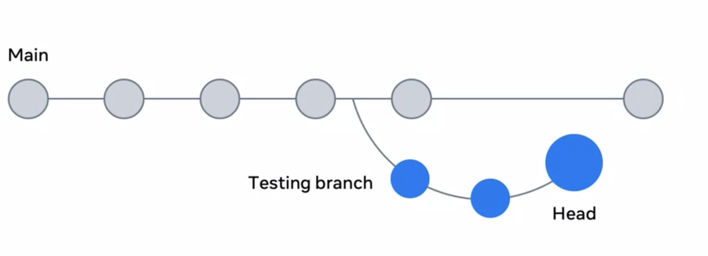
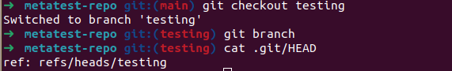
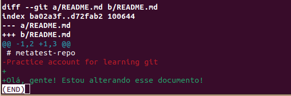
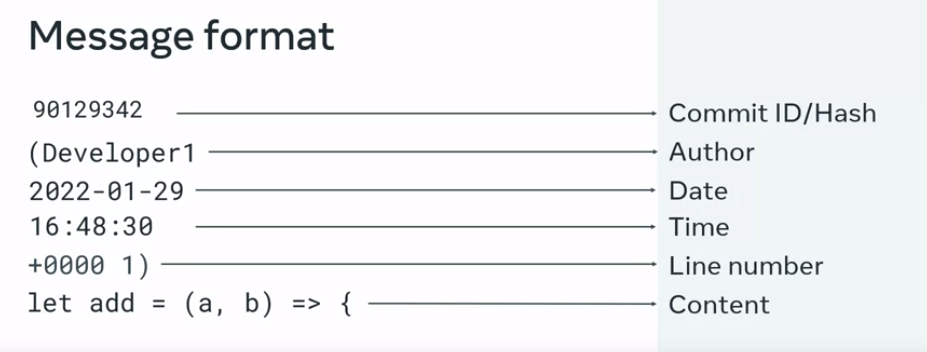

Git and GitHub Version Control:

Cloning from GitHub to my computer:

    mkdir <name>
    cd <name>
    git clone <link> 

If I list all the folders in the repo on my computer:

    ls -la

    total 16
    drwxrwxr-x 3 vahls vahls 4096 Mar 25 10:58 .
    drwxrwxr-x 3 vahls vahls 4096 Mar 25 10:58 ..
    drwxrwxr-x 8 vahls vahls 4096 Mar 25 10:58 .git
    -rw-rw-r-- 1 vahls vahls   50 Mar 25 10:58 README.md

Any file starting with a "." is hidden in Linux. The .git folder is where all changes are stored (it’s created automatically). Inside this repo, there's a "config" file, so the git commands I run on the command line edit this file.

Workflow

    - Modified: Add, remove, delete, or change files (git add).
    - Staged: This is when we run git add to make changes trackable.
    - Committed: The file is saved with changes, and there’s a snapshot of the modifications (git commit).
When I create a file and don’t run git add, it’s an "untracked file" (I can use git status to check this). To make it tracked, I need to run git add to include it in my commit. To unstage a file, I use:

    "git restore --staged <file>..." to unstage

After add and commit, all changes are in my local directory. To push them to the repo:

    git push

Creating a Branch:

    git checkout -B feature/lesson 
    #This will put all the content from the main branch into it
    git branch feature/lesson
    # This just creates a branch

The main branch doesn’t know about this new branch because it's isolated. Changes need to be merged:

    git push -u origin feature/lesson

From this point, any changes I make will go to feature/lesson and not to main. On GitHub, I click "Compare & pull request" to open a pull request for team review. Once approved, I can merge it.

Head

da4fd925d509cb76e198a61d9053bd82cb06d8b8: tthis is the hash ID referencing the current commit.

When I create a testing branch and run git checkout testing, the head now points to the testing branch:

cd5bcee50545bf509f0c2dc95b67ac10a11197af

Diff Commands (between branches, commits, and individual files)
After editing a file, I ran the diff command and got the following change report. Red shows removals and green shows additions:

    git log --pretty=oneline
    # Lists all the hash IDs with the changes

Blame

This command shows details about changes in a specific format:
    ID>Author>Date>Time>Linenumber>Content

    git blame -L 1,3 test2.txt
    # Limits the number of lines opened, since `blame` shows the entire file.

