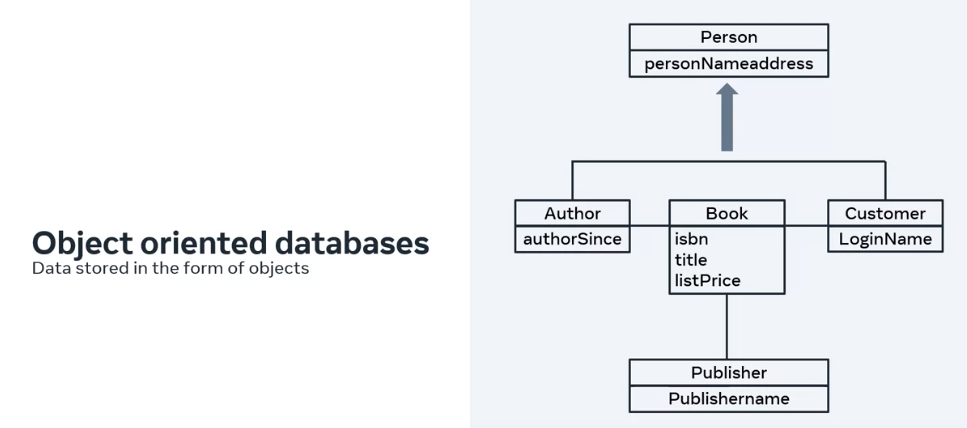
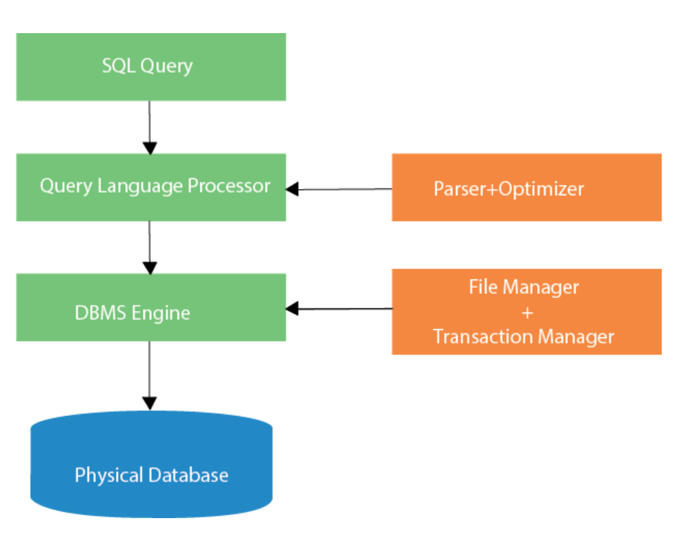
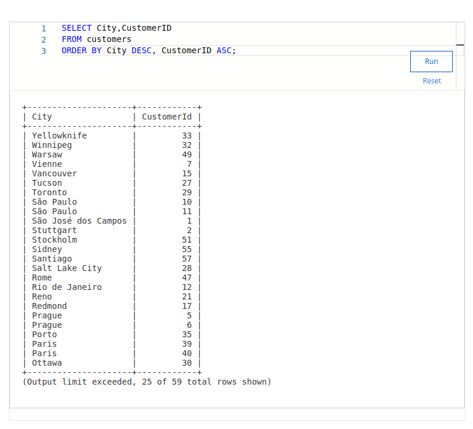
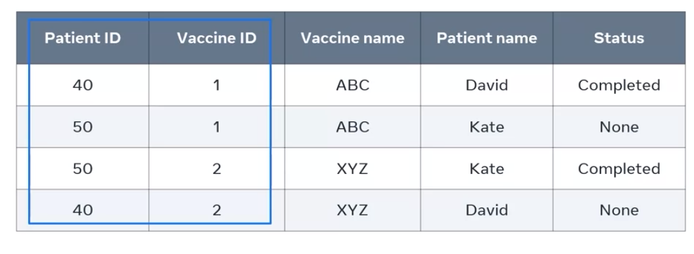

## Types:

- Object-Oriented:
    
- Graphs:
    
- Document JSON:
    

### Where they are stored: physically or in the cloud


In this image, we see the relationship between primary key and foreign key: the primary key is a unique key (Customer ID) that becomes a foreign key in an Order table, establishing the relationship between tables.

### Relational Databases: stores only structured data.

### SQL Databases: have a flexible structure for storing data and offer easy scalability.  
Types include:
- Document Databases
- Key-Value Databases
- Graph Databases

### Big Data:
- Data that grows exponentially
- Data from IoT
- Can be structured, semi-structured, or unstructured

### Cloud Hosting: Many companies are migrating to the cloud due to lower costs, more available services, ease of maintenance, and reduced risk of data breaches.

### Business Intelligence: It used to be just about storing data, but now businesses are using data to make decisions.

---

## Structured Query Language (SQL)

- How does the DB interpret SQL? Through the Database Management System (DBMS).
- CRUD (Create, Read, Update, Delete)
- SQL Subsets:  
        - **DDL** (Data Definition Language): defines the structure of tables/objects in a DB.  
        Operations:  
        - CREATE, ALTER, DROP  
        - **DML** (Data Manipulation Language): manipulates data.  
        Operations:  
        - **DQL** (Data Query Language): reads and retrieves data.  
        - **DCL** (Data Control Language): controls access to DB (grants and revokes privileges).

### Examples of Commands:

**DDL:**

- To create a database or tables inside the database:
```sql
CREATE TABLE table_name (column_name1 datatype(size), column_name2 datatype(size), column_name3 datatype(size));
```
- To delete a database or a table inside the database:
```sql
DROP TABLE table_name;
```
- To change the structure of the tables in the database:
```sql
ALTER TABLE table_name ADD (column_name datatype(size));
ALTER TABLE table_name ADD primary key (column_name);
```
- To remove all records from a table, which will empty the table but not delete the table itself:
```sql
TRUNCATE TABLE table_name;
```

**DQL:**

- To retrieve data from tables in the database:
```sql
SELECT * FROM table_name;
```

**DML:**

- To add records of data into an existing table:
```sql
INSERT INTO table_name (column1, column2, column3) VALUES (value1, value2, value3);
```
- To modify or update data contained within a table in the database:
```sql
UPDATE table_name SET column1 = value1, column2 = value2 WHERE condition;
```
- To delete data from a table in the database:
```sql
DELETE FROM table_name WHERE condition;
```

**DCL:**

- **GRANT**: provides database privileges to a user.
- **REVOKE**: removes permissions from any user.

### TCL (Transaction Control Language):

- **COMMIT**: saves all work done in the database.
- **ROLLBACK**: restores a database to the last committed state.

Notes:



- When an SQL command is executing for any RDBMS, then the system figures out the best way to carry out the request and the SQL engine determines how to interpret the task.

- In the process, various components are included. These components can be optimization Engine, Query engine, Query dispatcher, classic, etc.

- All the non-SQL queries are handled by the classic query engine, but SQL query engine won't handle logical files.


Tables are relations, entities, and objects - all refer to the same concept.

Columns are fields, attributes, and each has a data type.

Rows are "records"/registro...therefore, a record is a combination of columns, or fields, that contain data in my employee table. Through an employee, I obtain a single record.

Domains: a set of possible values within a specific data type. This ensures that only characters enter a particular column.

### Types of keys

**Primary key**

IDs are unique; each row/record is unique, so we use this row as the primary key. When there is no single column with unique values, a combination of columns (Composite key) can be used to achieve the purpose of the primary key.

Example of a primary key being used as a reference in another table and, therefore, recognized there as a foreign key:


**Alternate/candidate key**: like the primary key, contains a column with unique values but was not chosen.

### Data types:

**TINYINT**: small integers (max num 255)
**INTEGER**: 255 to 4 billion

**String types**: 

**CHAR**: fixed length (up to 255)
**VARCHAR**: variable length

**TINYTEXT**: 255 chars
**TEXT**: up to 65,000 chars
**MEDIUMTEXT**: 16.7 million chars
**LONGTEXT**: 4GB of text data

### Database constraints: limit the type of data that can be stored in a table. Example: an attempt to insert or upload invalid data:
- **Not Null constraints**: must be data 
- **DEFAULT "Barcelona"**: will be a default value, and the user does not need to type it every time a new instance is created.

```sql
CREATE TABLE Customer(
        customer_id int NOT NULL,
        customer_name varchar(255) DEFAULT "Barcelona");
```

### CREATE and DROP databases
(DROP FROM is to delete the table (or any other object) from the database)
```sql
CREATE DATABASE bookstore_db;
DROP DATABASE bookstore_db;
```

### ALTER TABLE statement

- Add a column to the table:
```sql
ALTER TABLE table_name ADD (column_name DATA TYPE);
```
- Delete a column from the table:
```sql
ALTER TABLE students DROP COLUMN nationality;
```
- Modify the size of VARCHAR to 100:
```sql
ALTER TABLE students MODIFY country VARCHAR(100);
```

### INSERT statement

Each value corresponds to each column, in the order they are described within the insert:
```sql
INSERT INTO table_name (column1_name, column2_name) VALUES (value1, value2);
```
or:
```sql
INSERT INTO players(ID, name, age, startDate) VALUES (1, "Yuval", 25, CURRENT_DATE());
```
Multiple players:
```sql
INSERT INTO players(ID, name, age, startDate) VALUES (1, "Yuval", 25, CURRENT_DATE(), 2, "Val", 32, CURRENT_DATE());
```
```sql
SELECT * FROM name_table;  -- selects all columns from the table, to specify columns, replace * with column names
SELECT name, level FROM players;
```

### INSERT INTO SELECT


### UPDATE


### DELETE
(DELETE FROM is to delete data within the table, not the table/object)


To delete an entire sector:


PS: if you do not specify correctly, everything in the table will be deleted
```sql
DELETE FROM student_tbl;  -- deletes all data from this table
```
```sql
TRUNCATE TABLE staff;  -- deletes all data from the table, similar to DELETE but faster as it does not do it individually and does not have a WHERE filter
```

## SQL Operators

```sql
SELECT column_name1 + column_name2 FROM table_name;
```


### Comparison operators (function as filters)


### Order by clause


Multiple columns: (Or all using *)


In the example below, there are two types of sorting, first it sorts the City column in descending order, and if there are repeated cases like Paris, it will sort in ascending order by customerId.



### WHERE clause


It will filter all those in the "faculty" column that start with Sc and are followed by several characters (%)


### SELECT DISTINCT clause
It will only take non-repeated values in a specified column

In the example below, two filters were applied, so it shows the nationality of each student without repeating the faculty (first criterion)


Counting how many distinct values there are:


## Database schema


Three categories:

**Logical**: The conceptual or logical schema describes the structure of the entire database for all the users. It describes the structure in terms of entities and features of the entities and the relationships between them. An Entity Relationship Diagram (ER-D) is usually drawn to represent the logical schema of a database. At this level, details about the physical storage and retrieval of data are hidden.


**Internal/physical**: The internal or physical schema describes the physical storage of the database. It represents the entire database but at a very low level. This means it describes how the data is really stored on disk in the form of tables, columns, and records. It defines what data is stored in the database and how.


**External/view**: The external or view schema describes the database like an external user would want to see it.


## Normalization Database

### NF1
Data atomicity: ONLY one single instance of value per column field.

Example: 
There are two pieces of information in Contact numbers.


I can split into two columns:


But now I have the tutor's information repeating, and the more subjects she teaches, the more repetitions I will have:


So I separate the information into two columns:


But now I must "link" one table to the other through the primary key in the Tutor table (Tutor ID) and pass it to the Course Table as a foreign key. This way, I achieved NF1 by correcting redundancies and also keeping the data related:


Normalization is a progressive process; which means after performing NF1, we can apply NF2 and NF3.

### NF2

Functionality dependency: when we have a column with unique values (which we usually use as a primary key) on which the other columns depend. Each column in the table depends on the functionality of the StudentID column:


Partial dependency:


It was necessary to break the table into 3 others to make all columns that are not primary key depend on all components of the primary key. Eliminating repetitions.


### NF3

Transitive dependency: A non-key attribute is functionally dependent on another non-key attribute. 
In the image below, there is only one transitive relationship: language and country. The other attributes are correct because the non-essential ones depend only on the primary key.


So how to solve this transitive dependency?

Break into two tables because there is no need to put the language the country speaks:

