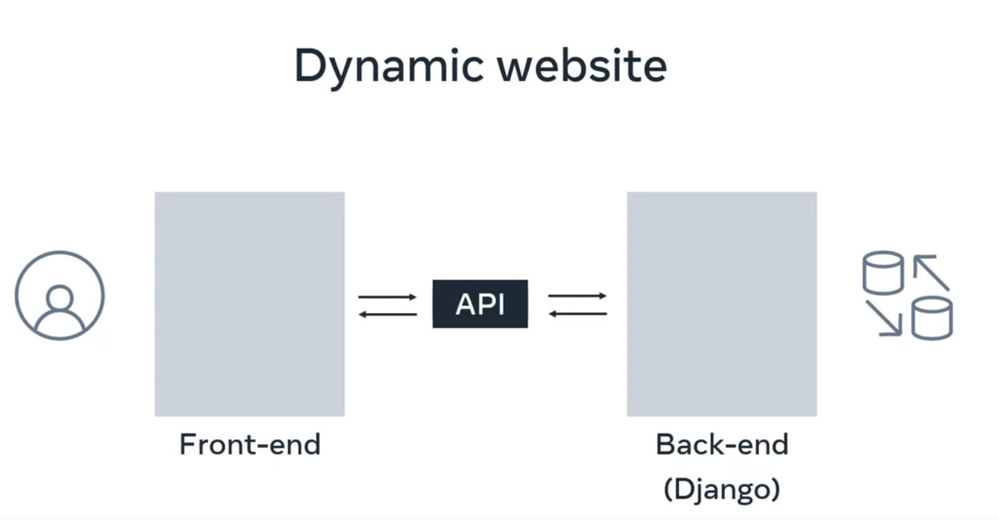

Note: no DB, the tables will have the following name ``<app_name>_<class_name_in_models.py>``

I created two tables (Vehicles and Customer)

It is a project that contains several apps:

For Django to recognize the apps:
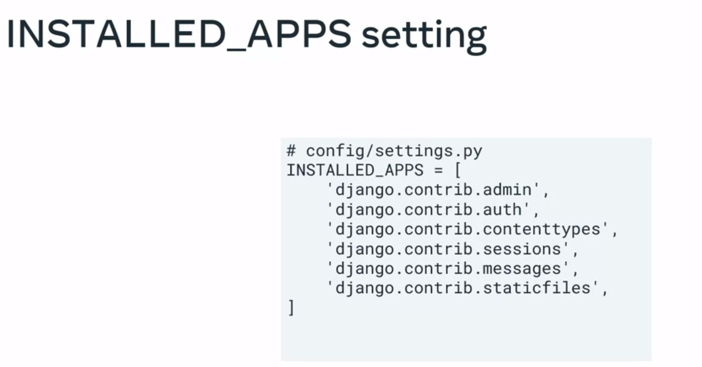

To create a virtual application, I need to create a virtual environment for the project, create the project, and then run the development server (or just use poetry):

With Django, there are two command line options:

    Django admin: ready-made administration interface.
    
    OR
    
    manage.py: a script that comes within the Django package

These are the logical layers of an application. They are not physically separated, they can be together on a web server.

In the MVC pattern:

Model: Represents the data and business logic.
View: Represents the presentation layer, responsible for displaying data to the user.
Controller: Acts as an intermediary between the model and the view, handling user input and updating the model accordingly.
However, in Django, the architecture is more accurately described as Model-Template-View (MTV):

Model: Represents the data and business logic, similar to the MVC pattern.
Template: Represents the presentation layer, responsible for defining the structure and layout of web pages.
View: Contains the business logic and handles user requests, interacting with the model and selecting the appropriate template for rendering.

The functions in views communicate with the model in two ways: either to retrieve (GET) data or to insert (POST) data.

Example of how we access models through view functions:
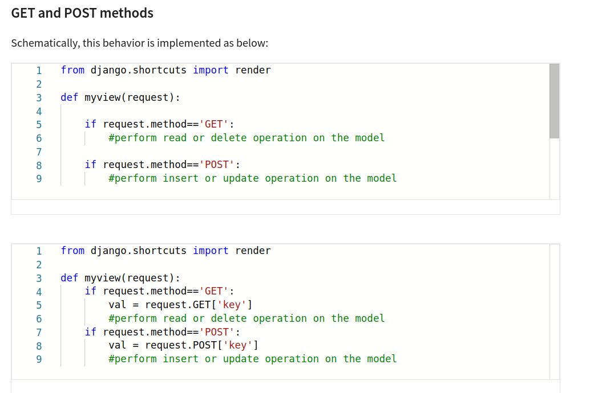

After that, you will have to respond to the client, and since the client is the web browser, you need to return an HTTP object with the actual content in text/html and the status code of the request.

The Django view loads the web page from the model, inserts certain context data into placeholders marked with tags, and returns it as a response:

So far, we have used functions to understand how views work. But the processing logic of these functions is imperative, which means there will be a lot of code repetition. Therefore, we will work with the concept of Class-based views. This is when we create a subclass of View that will handle, for example, GET and POST, and we can reuse it in different contexts:

<h1>Request and Response Objects</h1>

The request comes from the server as an object; after verifying the URL pattern, it calls the function declared in the object, passing the request body as an argument and returning another HttpResponse object.

Some uses:

    request.GET and request.POST
    The attributes return a dictionary-like object containing GET and POST parameters, respectively.

    request.POST is used to obtain the parameters from the request body (such as HTML forms) when the HTTP method used is POST. For forms submitted with the POST method, the data is sent in the request body, and request.POST contains this data as a dictionary similar to an HTML form.

    request.COOKIES
    Cookies are small pieces of data that a server can send to the browser, which the browser stores for future use. They are generally used to maintain user session state, such as authentication information, user preferences, items in an online shopping cart, among others.
    This is how you access cookies in Django:
    username = request.COOKIES.get('username')

    Note: It is important to keep in mind that cookies are sent by the browser and can be manipulated by the user. Therefore, you should be careful when relying on cookie data for critical security or authentication operations.

Similar to dict

<h1>Creating request and response</h1>

<h1>Understanding URLs</h1>

- Scheme: http (plain text data) or https (encrypts all data). It is the protocol

- Subdomain: www
Some sites hide the scheme and subdomain (it is done to make URLs more readable):

- Domain: it is divided into two levels:
second-level: it is the name itself
top-level: .com, .gov, .br, .org, etc.

- File path: address where a resource is stored. They can be local (my machine) or web-based

- Parameters:

Django processes both, but mainly URL parameters: 

<h1>RegEx in URLs</h1>

By using named URLs, you can make your application more flexible and easier to maintain. If you ever need to change the URL of a particular view, you can do so in the urls.py file without having to update every reference to that URL throughout your project.
- Subdomain: www
Alguns sites ocultam o scheme e o subdomínio(é feito para tornar urls mais legíveis):

- Domain: é divido em dois níveis:
second-level: é o nome em sis
top-level: .com, .gov, .br, .org, etc.

- File path:endereço onde um recurso está guardado. Podem ser locais(minha máquina) ou web-based

- Parameters:

Django processa ambos, mas principalmente os parâmetros de URL: 

<h1>RegEx in URLs</h1>

By using named URLs, you can make your application more flexible and easier to maintain. If you ever need to change the URL of a particular view, you can do so in the urls.py file without having to update every reference to that URL throughout your project. This approach promotes code reusability, scalability, and maintainability.

The problem comes when the view function of the same name is defined in more than one app. This is where the idea of a namespace is needed.

<h1>Handling Errors in Views</h1>
The main difference in using HttpResponseNotFound as opposed to HttpResponse that must be understood is that Django internally sends an error code 404. The appropriate page for 404 can then be configured and rendered, else the browser displays its default 404 view. 

Custom error pages

If you want to show your own error page whenever the user encounters a 404 error, you must create a 404.html page and put it in the project/templates folder

<h1>Models</h1>

- cada mtabela é uma classe python;

- cada atributo é um campo na do db;

- não precisa escrever as queries, basta usar o model para isso;
- Django fornece um db gerado automaticamente e API de acesso

* Id é criado automaticamente pelo django(we can override if needed)

Depois disso, precisamos usar migrations para terminar o processo de criação de tabela.

Create:

Read:

Update:

Delete:

<h1>Model relationships</h1>

1 to 1: each record in one table corresponds to a record in another table. For example, directors table and universities table. Each university has only one director and vice versa.

1 to many (example)

See other types of relationships
<h1>Creating Models</h1>

- create the class in models
- add it to INSTALLED_APPS in settings.py at the project level
- run migration: python manage.py makemigrations (this will create a file in migrations)
- python manage.py migrate
- all created models need to be registered in admin.py of each app:
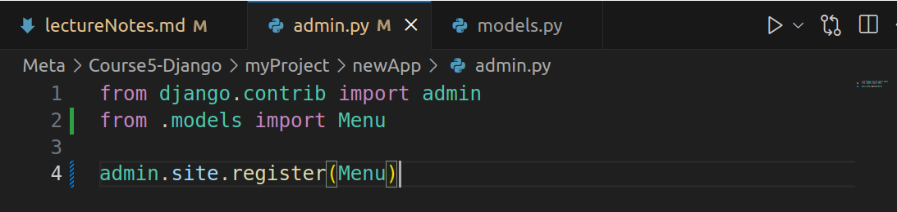

To test, python manage.py shell
python manage.py makemigrations
m = Menu.objects.create(name='Pasta', cuisine= 'Italian', price = 100)
Menu.objects.all()
Use the primary key to access an object and after that, I will change the value of the cuisine field:

p = Menu.objects.get(pk=1)
p.cuisine = 'Chinese'
p.save()
And I have this result:
Menu.objects.all()
<QuerySet [<Menu: Pasta : Chinese>, <Menu: Tacos : Mexican>]>

<h1>Database migrations</h1>

This is how Django records changes made to models and implements these changes to the database. Migrations are linked to models and stored as migration files in a migration folder within each app.

If you want to add a column to the table, just add it to the model code and then run the migrations to register the change:

Example: added City

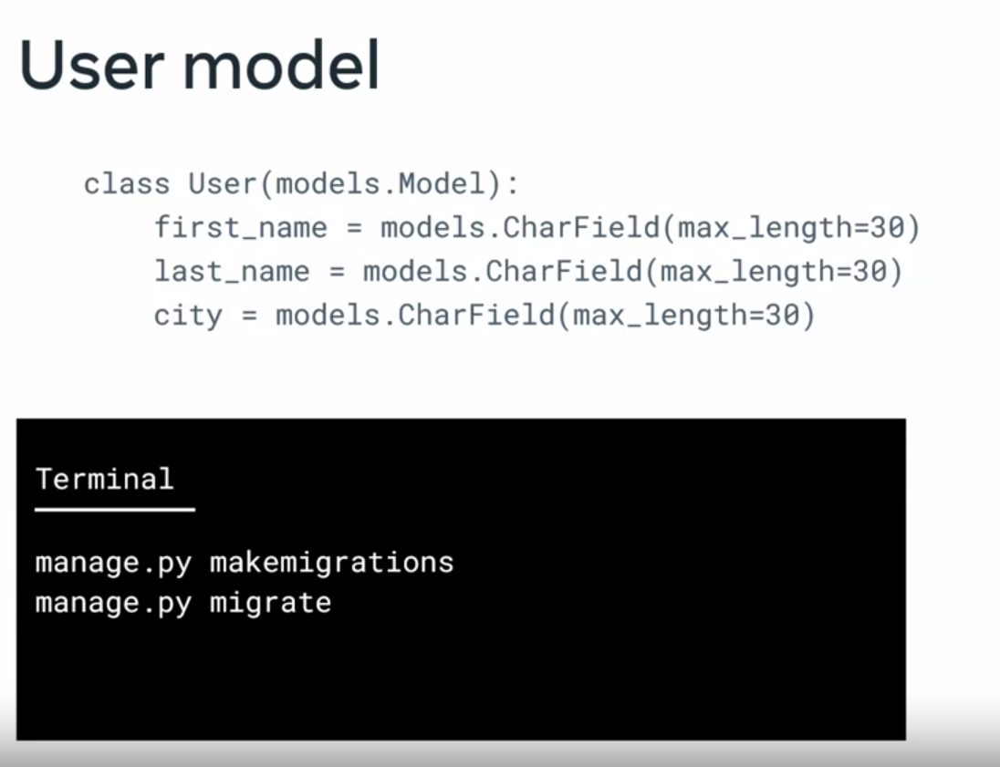

And not only that, Migrations help with synchronization issues, version control, and database maintenance.

- Syncing issues: each developer has a local copy of the database, but the migration scripts are in the code repository. When a developer makes changes, they run the scripts and everyone gets the latest version of the database (with the developer's changes).

- Version control: keeps a history of all changes and who made them, tracks everything. The more tracked the changes are, the fewer problems will arise. The alternative is to run the scripts directly on the database, but then it's completely out of version control.

- Maintenance: helps with synchronization and tracking changes, making it easier to maintain the database.

How to use migrations:

Django has the following commands:
    - makemigrations
    - migrate
    - sqlmigrate
    - showmigrations

Migration in Django is a version control system. After any change, you need to run the "makemigrations" command. This creates a script to make changes to the mapped table. Every time you run this command, Django detects all changes and a script with the name and version is created. To actually implement these changes, you need to run the migrate command.

The data needs to be stored through these apps for their functionality to work. For example, the auth package controls users, groups, and permissions, so there must be corresponding tables created in the database. Django uses the SQLite database by default. For this purpose, you run the Migrate command.

This is what a migration Python file looks like:

If I want to change a variable, I just change it in the model directly and run "python manage.py makemigrations" in the terminal and a new script is created in migrations within the app in question. After that, I run: "python manage.py migrate"

"python manage.py makemigrations": is the command that generates the SQL commands
"python manage.py migrate": is the command that actually executes it on the database

Another command is to undo changes we made. Just run the migrate command passing the app and the script

If I run it without the --plan flag, it actually performs the rollback to 0001.

Some operations that occur within migrations:

<h1>ORM (library)</h1>

In tables, we have primitives like data, and in languages, we have some types that are not scalar (arrays, classes, objects, dict, etc.) and need to be converted so that Python can manipulate SQL, for example.

The ORM layer maps a class to a table in a relational database, with its attributes corresponding to the table fields. Django has its own ORM layer. Its migration mechanism propagates the models into the database tables.

You need to use a QuerySet through a Manager of your model class to retrieve objects from your database.

After creating the classes (tables) in the model, registering the model in the app's admin, and running the migrations... you create an object through the shell:

Using <class name>.objects has some methods and it performs operations on the database without you needing to write SQL. The manager is not a single object but a collection of methods that act on the model data. The ".objects" already comes within each model class.

Or (BETTER) use Django's built-in manager (QuerySet API):

The functions that Django has that support operations (QuerySet) on the database:
    - methods that return new query sets;
    - operators that return new query sets (e.g., "&" between two queries);
    - methods that do not return new query sets.

How to list objects using the manager:

Applying filters:

To connect a model class to another, we need the following configuration within the child class:

The on_delete property in the ForeignKey field specifies what happens to a record in the child table (the table with the foreign key) if the corresponding record in the parent table (the table referenced by the foreign key) is deleted. This helps maintain data integrity in your database.

<h2>Models and forms</h2>

Forms: web applications collect user data through an HTML form.

    Form fields: help define the visualization of the form element.

Example of using static Form API:

Now let's modify it to use ModelForm, which is a class offered by Django that already saves form inputs to the database:

1. Create the model:

2. Register it in the admin
3. Create the forms.py file:
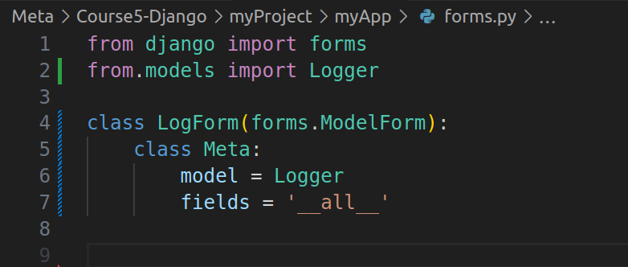
4. Add the path to the function in views.py in urls.py (path('form/', views.form_view))
5. In views:

6. Create a directory called Templates and inside it an HTML file:

<h2>Admin</h2>
Once we create a web application, we need to save some of the content somewhere, like in the database. Therefore, we need an ADMIN as part of the application itself. And this class will allow users to manage the application's data (restaurant owners adding, deleting, editing items). So, we will use Django's administration interface that it creates automatically (we don't need to create one for each project every time, Django does it). This is an automated process because this interface links to the models once they are registered.

python manage.py createsuperuser

Example: If we want to create a Reservation, for example, just: create the model, register it in the admin, run the migrations, create a superuser, check if the app is in settings.py, run the server, and go to local/admin, log in, and add reservations there.

<h1>Permissions</h1>

- 3 types of users (in Django):
    - User
    - Staff user
    - Superuser

How to create?
Staff user
- python manage.py shell
- from django.contrib.auth.models import User
- usr=User.objects.create_user('testusr', 'test@abs.com', 'pass123')
- usr.is_staff=True
- usr.save()

Superuser (has all permissions)
python manage.py createsuperuser

Permission

There are several places where you can assign permissions: in the admin, in the model, in the specific object.

Check if a user has permissions and generate an error if they don't:

To avoid setting permissions for each person, you use Django's group concept. And then you give permissions to a specific group.

<h1>Model Permissions in Admin Interface</h1>

<h1>Enforcing permissions at the view level</h1>

<h1>Enforcing permissions at the template level</h1>

<h1>Enforcing permissions in URL pattern</h1>

<h1>Database config</h1>

When a Django project is created, SQLite is automatically set as the database in settings.py. We don't need to install anything because it doesn't run as a server process. This means the database doesn't need to be started, stopped, or have configuration files. However, this type of database is recommended for small applications or rapid prototyping.

We will use MySQL from now on. For this, we will need:
- Address: 127.0.0.1
- Port: 8000
- Database: django.db.backends.mysql
- Database driver: which is responsible for mapping all models and translating Python queries into SQL commands;

To use MySQL, the driver or connector, the MySQL client needs to be installed;
When you connect to the database, the connection will remain open for a while (controlled by the parameter: CONN_MAX_AGE)

Unlike SQLite, which came by default in Django, MySQL needs to be installed on my machine because these settings will now be on the host. And this is a deliberate security measure, keeping them separate.

Note: it is also possible to use a MySQL options file to store connection credentials (we will see this later)

Django with SQLite automatically creates all tables based on the models I have, but MySQL requires me to manually create the database. For this, I need to configure the connection and permissions for authentication and authorization. Keeping data secure is of utmost importance. Connection credentials should only be accessible through the virtual machine or the server where the web application is running.

Step-by-step guide on how to configure MySQL in Code and MySQL on my host:

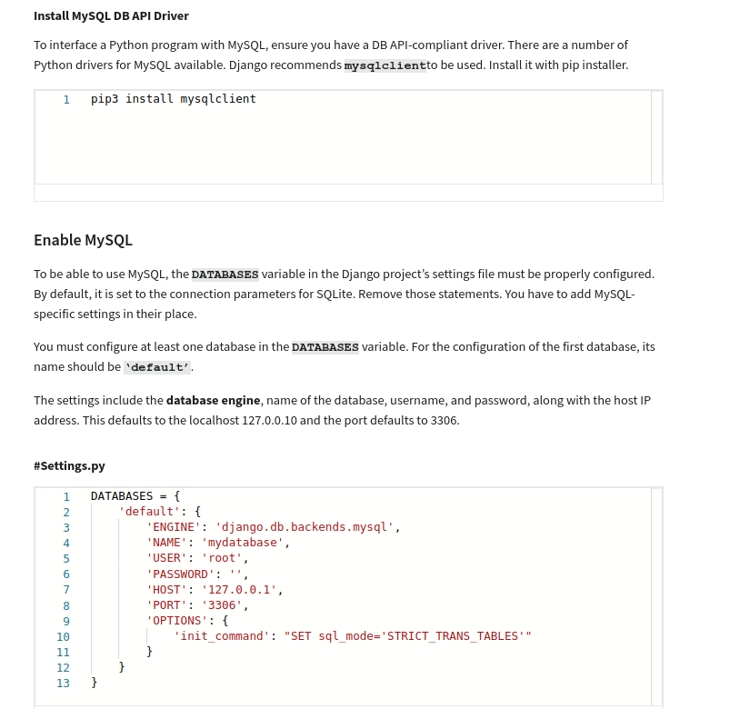

**Note: I put the password directly in settings.py, but in the future, I will use environment variables.**

I created the admindjango user:

    CREATE USER 'admindjango'@'localhost' IDENTIFIED BY 'Password@123';

Granted all privileges:

    GRANT ALL ON *.* TO 'admindjango'@'localhost';
    FLUSH PRIVILEGES;

<h1>Templates</h1>
A template is responsible for the view layer of the MVT architecture; it is the logical user interface on a webpage. It contains both static and dynamic content.

Dynamic content within static content:

The static part (HTML) defines the layout of the page.
The view functions using the render function will be responsible for processing the dynamic content:

Since Python is a dynamic OOP and HTML is static, the bridge between them is made by the Django template engine and Django template language - DTL (variables, tags, filters, comments).

We need to inform in settings.py where Django will look for the templates (we must add the templates of each application here):

It is possible to use other template engines like Jinja2, for example. To configure it, we add it inside OPTIONS:

Template inheritance

It is a way to reuse code (header, body, and footer) by just adding the dynamic content to these pages.

Template examples:

In the same way that I pass a phrase to the response, I can pass a script with the HTML of an entire page in a string. And what if there is dynamic content in the middle? If I want the user's name to appear on the page? In the request, it is necessary to bring the name so that the function can use it.

Generating HTML from Python code takes time and can be complicated. It requires frequent escaping, especially if there are many variables.

Introducing some conditional logic will be more difficult. This is when you use templates.

A template is an HTML file with placeholders for variable data marked by special syntax. Django uses its own template language called Django Template Language (DTL). Just like HTML, DTL has its own tags that control how the variable part is filled.

Example of an About view function:

Template:

Note: remember to update settings.py, create a templates directory in the root;

<h1>DTL</h1>

Dynamic data will come from a database, a calculation, or a value assigned to a variable, from an application... the web framework will need to understand this data. For this, Django uses DTL to separate the "presentation" from the logic. A template in Django is a marked text document/Python string and interpreted by the template engine.

- Constructors of DTL syntax:

    - variables: dict where "restaurant_name" is the key and 'Little Lemon' is the value;

        {restaurant_name: 'Little Lemon'}

    Note: When rendered, it will display the message: "Welcome to the Little Lemon Restaurant".

    - filter: can change the values of the variables

    - comment:

    - tags: 

For conditionals and loops:
<h2>True:</h2>

<h2>False:</h2>

<h2>Iterate a dict to show a list of items:</h2>

We pass a dictionary directly from the views dynamically:

<h2>How to create a dynamic menu by passing a model object (retrieve data from the DB to the screen) to the template through the view</h2>

<h2>Template Inheritance</h2>

We use a template called base.html where we configure the header, body, footer, etc. (the general structure of my pages). Then, in the HTML of each page, we just extend base.html. If I need to update a part of this structure, I will do it only once. I will use 'blocks' to define the parts that can be replaced or extended in child templates:

I create the child templates and use the directive 

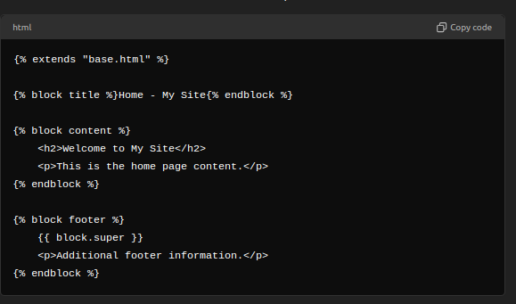

And now I replace or extend the blocks created in base.html

Inside base.html I will include the _header.html.

 is for security.

<h1>Debugging</h1>
<i>Remove errors and bugs</i>

Django has the default debugger DEBUG = True in settings.py (which is not recommended for production environments). Since it is written in Python, we have several libraries that can help, and the web page itself also provides information. There will be errors that do not prevent the server from running and will be discovered later. For example: if you do not include the token , it will allow you to fill out the form, but when saving to the DB, it will give an error.

<h1>Testing</h1>
<i>Metrics for quality, reliability, and performance</i>

Unit test: tests a part

<h1>Sub-classing Generic Views</h1>

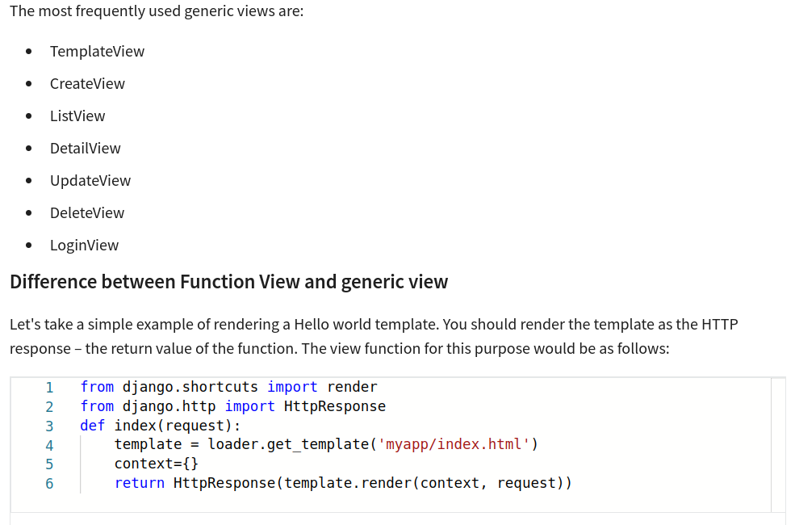

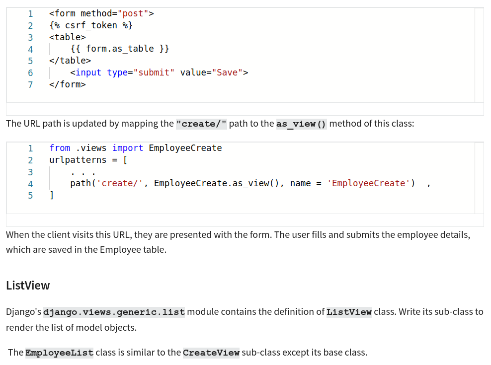

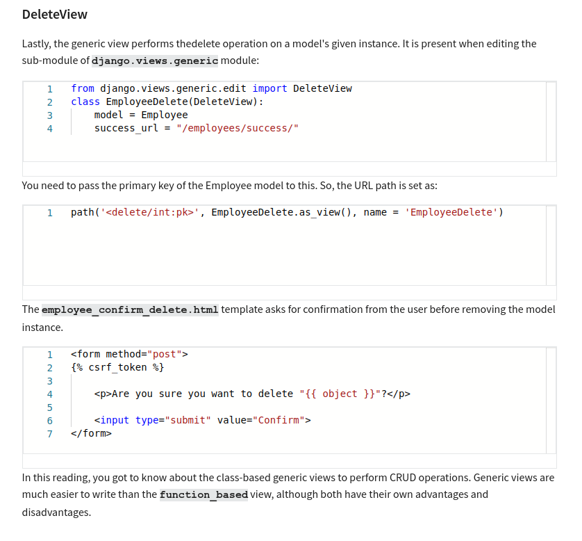